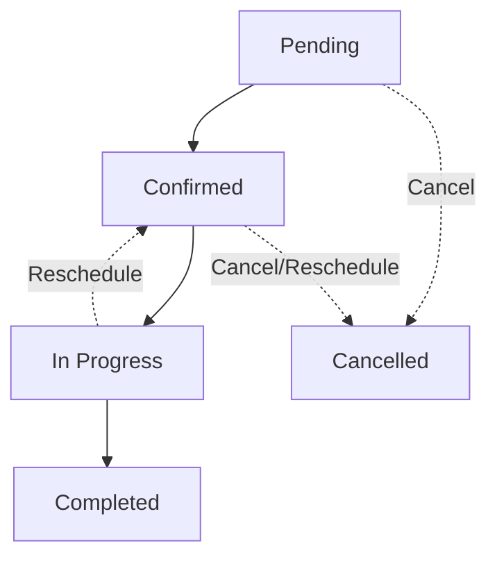

# 🛠️ Smart Service Booking System

A premium, full-stack, enterprise-ready service marketplace platform designed for booking home services (cleaning, electrical repair, plumbing, and other doorstep support). This repository demonstrates a highly scalable MERN architecture, robust authentication models, strict database validations, dynamic status tracking, containerization, and full-fledged CI/CD configuration.

---

## 📋 Table of Contents
1. [What This Project Demonstrates](#-what-this-project-demonstrates)
2. [Key Architecture & Tech Stack](#-key-architecture--tech-stack)
3. [Core Functional Workflows](#-core-functional-workflows)
4. [Project Directory Layout](#-project-directory-layout)
5. [Detailed API Endpoints Registry](#-detailed-api-endpoints-registry)
6. [Local Environment Setup](#-local-environment-setup)
   - [Backend Configuration](#1-backend-configuration)
   - [Frontend Configuration](#2-frontend-configuration)
7. [Admin Provisioning & Seeding](#-admin-provisioning--seeding)
8. [DevOps, Containerization & CI/CD](#-devops-containerization--cicd)
9. [Automated Test Suite](#-automated-test-suite)
10. [Portfolio & Resume Impact Guidelines](#-portfolio--resume-impact-guidelines)

---

## 🚀 What This Project Demonstrates

This project represents end-to-end product thinking, showing how complex business workflows can be implemented with clean, decoupled architecture:
*   **React SPA**: Developed on top of Vite with highly modular component rendering, path-based routing, and fluid animations.
*   **Decoupled REST API**: Node.js and Express backend enforcing strict Request-Response cycles, secure middlewares, and utility helpers.
*   **Strict Security & RBAC**: Implementation of JWT-based authentication paired with Role-Based Access Control (RBAC) separating customers and admins.
*   **Double-Booking Prevention**: High-integrity reservation engine verifying overlapping timeslots in the database before completing a transaction.
*   **DevOps Pipelines**: Built-in Docker containers, local compose environments, and a comprehensive automated Jenkins declarative pipeline.

---

## 💻 Key Architecture & Tech Stack

### Frontend Architecture
*   **Core Library**: React 19 (Functional Components with Hooks)
*   **Build Tool**: Vite (Extremely fast HMR development server)
*   **UI System**: Material UI (MUI 7) & Emotion (Theming, grids, and premium micro-interactions)
*   **Routing**: React Router DOM (v7) supporting protected browser paths
*   **Animations**: Framer Motion (Smooth page transitions and component enters)
*   **HTTP Client**: Axios (Configured with request/response interceptors)
*   **Notifications**: React Hot Toast

### Backend & Database Architecture
*   **Runtime Environment**: Node.js
*   **Web Framework**: Express.js
*   **Primary DB**: MongoDB (Cloud-hosted Atlas instance in production)
*   **ORM / ODM**: Mongoose (Schema validation, query modeling, and document population)
*   **Authentication**: JSON Web Tokens (`jsonwebtoken`)
*   **Security & Hashing**: `bcryptjs` (Blowfish-based salt and hash functions)
*   **CORS Management**: Dynamically parsed allowed-origins helper

---

## ✨ Core Functional Workflows

### 1. Customer Booking Portal
*   **Real-time Catalog**: Dynamic extraction of available services including images, pricing models, and duration estimates.
*   **Dynamic Time Slot Locking**: Customers can query specific dates to fetch currently occupied slots and prevent overlapping reservations.
*   **Address Coordinates**: Real-time address matching with coordinate structures stored inside geo-JSON formats on the backend.
*   **Comprehensive OTP Flow**: Verification subsystem verifying phone numbers with mock/in-memory OTP dispatch and token consumption.

### 2. The Booking Lifecycle Engine
The booking document progresses dynamically through an Express state machine:
*   `pending`: Default state on reservation creation.
*   `confirmed`: Formally acknowledged and staffed by administrative actions.
*   `in_progress`: Real-time onsite activity state.
*   `completed`: Successfully executed and settled.
*   `cancelled`: Terminated bookings with logged cancellation reasons and indicators of who initiated it (`user` or `admin`).



### 3. Admin Control Center
*   **Protected Dashboard**: Live workspace rendering all bookings on the platform with metrics and data filtering.
*   **Status Management**: Dropdowns allowing admins to alter booking states along the lifecycle pipeline.
*   **Service Catalog Operations**: Form fields to create, update, or permanently delete service records from the database.

---

## 📂 Project Directory Layout

```text
Fullstack-Smart-service-booking-system/
├── Backend/
│   ├── index.js                  # Primary entry point, CORS configuration, and REST endpoints
│   ├── db.js                     # MongoDB connection pool setup using Mongoose
│   ├── models/                   # Strict schema definitions
│   │   ├── Booking.js            # Complex bookings document containing geolocation, phone, date & slots
│   │   ├── Service.js            # Services registry catalog
│   │   └── User.js               # Users and Admin profile database collections
│   ├── middler/                  # Express middleware layer
│   │   ├── authMiddleware.js     # Validates JWT tokens and injects user identity into requests
│   │   └── adminMiddleware.js    # Restricts administrative endpoints to admins
│   ├── utils/                    # Data validation helpers
│   │   ├── authValidation.js     # Sanitizes requested roles & checks admin provisioning keys
│   │   └── bookingValidation.js  # Normalizes input dates, phone numbers, and coordinate structures
│   ├── tests/                    # Automated testing suites
│   │   ├── authValidation.test.js
│   │   └── bookingValidation.test.js
│   ├── seedAdmin.js              # Command Line Interface (CLI) administrative seeder script
│   └── seedServices.js           # CLI database catalog initial populator script
├── Frontend/
│   └── smart-service-booking/    # High-performance React application folder
│       ├── src/
│       │   ├── Pages/            # View components & screens
│       │   │   ├── Home.jsx      # Portal hero landing page
│       │   │   ├── Login.jsx     # User & Admin authentication portal
│       │   │   ├── Register.jsx  # Double-role registration forms
│       │   │   ├── Services.jsx  # Interactive booking workflow screen
│       │   │   ├── Bookings.jsx  # User dashboard supporting tracking, editing, rescheduling
│       │   │   └── admin/        # Administrative sub-pages
│       │   ├── components/       # Custom reusable components
│       │   ├── services/         # Client-side API abstraction functions
│       │   ├── theme.js          # Material UI custom dark/light theme options
│       │   ├── App.jsx           # Main routing switchboard & globally shared states
│       │   └── main.jsx          # DOM entry point
│       └── vercel.json           # Vercel single-page-routing rewrite configurations
├── Dockerfile                    # Multi-stage production container setup
├── docker-compose.yml            # Multi-service local execution compose file
├── nginx.conf                    # Nginx routing server configuration file
├── Jenkinsfile                   # Declarative pipeline script for end-to-end automation
├── DEPLOYMENT.md                 # Brief steps for cloud deployments
└── README.md                     # Complete project documentation
```

---

## 🔌 Detailed API Endpoints Registry

| HTTP Method | Endpoint | Authentication | Required JSON Payload | Purpose / Response |
| :--- | :--- | :--- | :--- | :--- |
| **POST** | `/register` | Public | `{ name, email, password, role, adminSetupKey? }` | Registers a new user. Admins must provide valid `adminSetupKey`. |
| **POST** | `/login` | Public | `{ email, password }` | Authenticates user & returns token with role. |
| **GET** | `/services` | Public | *None* | Fetches the full active catalog of services. |
| **POST** | `/add-service`| JWT + Admin | `{ title, icon, image, price, estimatedDuration }` | Registers a new service in the catalog database. |
| **DELETE**| `/services/:id`| JWT + Admin | *None* | Permanently removes a service from catalog. |
| **POST** | `/book` | JWT (User) | `{ serviceTitle, userName, Phone, slot, bookingDate, location }` | Creates a new service booking, validating slot overlap. |
| **GET** | `/bookings` | JWT (User) | *None* | Retrieves all bookings matching current user's ID. |
| **DELETE**| `/bookings/:id`| JWT (Owner/Admin)| *None* | Deletes a booking from the system history. |
| **PUT** | `/bookings/:id`| JWT (Owner/Admin)| `{ status }` | Changes the lifecycle state (e.g., `in_progress`). |
| **PUT** | `/bookings/edit/:id` | JWT (Owner) | `{ userName, Phone, location? }` | Updates primary contact info on active bookings. |
| **PUT** | `/bookings/:id/reschedule` | JWT (Owner) | `{ slot, bookingDate, reason? }` | Shifts slot/date of active booking; re-verifies availability. |
| **PUT** | `/bookings/:id/cancel` | JWT (Owner/Admin)| `{ reason? }` | Marks booking status as `cancelled` with metadata log. |
| **GET** | `/admin/bookings`| JWT + Admin | *None* | Retrieves all system bookings populated with email identities. |
| **POST** | `/send-otp` | Public | `{ phone }` | Emits a 6-digit verification code to the server logs. |
| **POST** | `/verify-otp` | Public | `{ phone, otp }` | Confirms OTP and unlocks form booking submission. |
| **GET** | `/available-slots`| Public | Query param `?date=YYYY-MM-DD` | Returns an array of unreserved timeslots for a date. |

---

## 🛠️ Local Environment Setup

### Prerequisites
Make sure you have node.js (v18+) and MongoDB installed locally or have a MongoDB Atlas connection string.

---

### 1. Backend Configuration

1. Navigate to the `Backend` directory:
   ```bash
   cd Backend
   ```
2. Install npm dependencies:
   ```bash
   npm install
   ```
3. Create a `.env` file in the `Backend` root directory:
   ```env
   PORT=5000
   MONGO_URI=mongodb://localhost:27017/serviceBookingDB
   JWT_SECRET=super_secret_jwt_string_1234
   ADMIN_SETUP_KEY=secure_company_admin_passkey_99
   CLIENT_URLS=http://localhost:5173
   ```
4. Start the backend developer server:
   ```bash
   npm start
   ```

---

### 2. Frontend Configuration

1. Navigate to the `Frontend/smart-service-booking` directory:
   ```bash
   cd Frontend/smart-service-booking
   ```
2. Install npm dependencies:
   ```bash
   npm install
   ```
3. Create a `.env` file inside `Frontend/smart-service-booking/`:
   ```env
   VITE_API_BASE_URL=http://localhost:5000
   ```
4. Start the Vite React development server:
   ```bash
   npm run dev
   ```
5. Open your browser and navigate to the address displayed (usually `http://localhost:5173`).

---

## 🔑 Admin Provisioning & Seeding

### 1. Seeding Sample Services
To quickly populate the database with professional home services (Plumbing, Cleaning, Electrical, etc.) including high-resolution mock imagery, run:
```bash
cd Backend
node seedServices.js
```

### 2. Generating Admin Users via Command Line
To bypass frontend flows or securely provision a primary administrative profile directly in the database, use our CLI seeding tool:
```bash
cd Backend
npm run seed:admin -- "Admin Name" admin@booking.com Password123
```
This utility automatically encrypts the password with bcrypt, assigns the `admin` role, and bypasses registration validation checks.

---

## 🐳 DevOps, Containerization & CI/CD

The project is fully prepared for continuous integration and container-based environments:

### 1. Local Containerized Orchestration (Docker Compose)
To compile the full system locally under isolated network conditions, run:
```bash
docker-compose up --build
```
This command maps public client-side ports to nginx reverse proxies while preserving database configuration.

### 2. Automated Pipelines (Jenkinsfile)
A declarative multi-stage `Jenkinsfile` is included in the project root:
*   **Checkout & Setup**: Fetches workspace code and configures runtimes.
*   **Build**: Generates optimized production bundles for Frontend and compiles Node components.
*   **Test**: Runs the integrated validation test suite automatically.
*   **Dockerize**: Compiles the final production-ready image and tags it for deployment registry publication.

---

## 🧪 Automated Test Suite

A comprehensive unit test suite is written using standard Jest testing parameters. It validates validation models and data inputs:
*   **Auth Checks**: Checks role normalization strings (`customer`, `admin`) and validates secure key verification pipelines.
*   **Booking Validators**: Ensures phone formats, calendar dates, and coordinates comply with safety limits.

To run tests on the backend:
```bash
cd Backend
npm test
